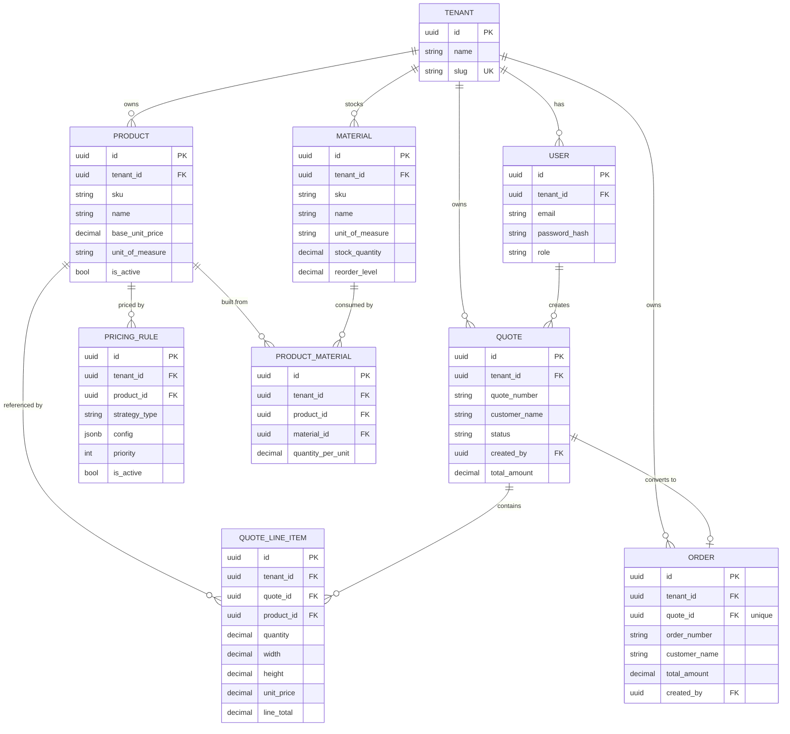

# ForgeFlow

[](https://github.com/UygarGokcen/forgeflow/actions/workflows/ci.yml)

**Multi-tenant manufacturing CPQ (Configure-Price-Quote) & order management platform.**

A SaaS backend for B2B manufacturers that sell custom-made products, like cut-to-size panels or
made-to-order parts. It turns a customer request into a priced, tracked quote instead of a
spreadsheet.

---

## Business Problem

Small and mid-size manufacturers (metal fabrication, custom furniture, signage, glass cutting)
sell products where the price depends on more than a SKU. It depends on how many you order, the
surface area, the material, and the agreed terms.

In practice this pricing logic lives in someone's head or in a spreadsheet. Quotes get retyped
into orders by hand, and there is no single place a sales rep, an ops manager, and finance can
all look at.

CPQ tools already exist, but they are usually built for large single-tenant companies. A vendor
that wants to serve *many* small manufacturers needs proper tenant isolation, plus pricing rules
that can actually be extended in code.

## Why ForgeFlow

- **Multi-tenant from the start.** Tenant isolation is enforced by the database itself
  (Postgres Row-Level Security), not only by application code. So even if a service class has a
  bug, one tenant can't read another tenant's data.
- **Pricing is a strategy, not a formula in a spreadsheet.** Volume discounts and area-based
  pricing (price a cut panel by width × height, not per piece) are separate
  [`PricingStrategy`](src/main/kotlin/com/forgeflow/service/pricing) classes, set up per product
  with JSON config instead of hardcoded `if` statements. The config is checked when the rule is
  created, so a bad rule fails right away with a 400 instead of producing a wrong quote later.
- **A real quote lifecycle.** `DRAFT → APPROVED → CONVERTED_TO_ORDER` (or `REJECTED`) is an
  explicit state machine, not a free-text status column. Invalid jumps are rejected and an empty
  quote can't be approved. Converting a quote creates a real `Order` row with its own table and
  number, instead of just flipping a flag.
- **Inventory that matches how a workshop really works.** Stock is kept on raw *materials*, not
  on finished goods, because nobody keeps pre-cut 2m × 1.5m panels on a shelf. Each product has a
  recipe of how much material one unit uses. Converting a quote subtracts that material in the
  same transaction that creates the order, so you can't accept a job you don't have the steel for.
- **Simple, standard infrastructure.** Flyway instead of an `init.sql`, JWT + Postgres RLS
  instead of a `WHERE tenant_id = ?` you can forget to write, and one `docker-compose up` to run
  everything.

## Architecture

**Stack:** Kotlin + Spring Boot 3 (Java 21) · Spring Security + JWT · PostgreSQL 16 + Row-Level
Security · Redis · Kafka · Flyway · Docker Compose · springdoc-openapi (Swagger UI) · JUnit 5 +
Testcontainers

It is a **modular monolith**, organised by layer:

```
com.forgeflow/
├── config/     Security (JWT filter, SecurityConfig), the tenant-aware transaction manager, OpenAPI
├── context/    TenantContext, CurrentUser — per-request, backed by Spring's RequestAttributes
├── domain/     JPA entities: Tenant, User, Product, PricingRule, Quote, QuoteLineItem, Order,
│                             Material, ProductMaterial
├── event/      OrderConvertedEvent + its Kafka publisher/listener
├── dto/        Request/response DTOs (kept separate from the entities)
├── repository/ Spring Data JPA repositories
├── service/
│   └── pricing/  Strategy pattern: PricingStrategy + Fixed/VolumeDiscount/AreaBased
├── controller/ REST endpoints
└── exception/  Sealed ApiException classes + one @RestControllerAdvice
```

### Multi-tenancy: JWT claim + Postgres RLS

1. The JWT holds a `tenant_id` claim, set at login or registration. The client can also send an
   `X-Tenant-ID` header, but it is compared against the claim and rejected with 403 if they don't
   match. So the header can never widen access, only confirm it.
2. `JwtAuthenticationFilter` reads the claim and puts it in
   [`TenantContext`](src/main/kotlin/com/forgeflow/context/TenantContext.kt). This uses Spring's
   `RequestAttributes` instead of a plain `ThreadLocal`, because attributes are tied to the
   request itself. A pooled thread can't carry one request's tenant into the next request.
3. Every tenant table has `ENABLE ROW LEVEL SECURITY` **and** `FORCE ROW LEVEL SECURITY` (see
   [`V1__init_schema.sql`](src/main/resources/db/migration/V1__init_schema.sql)), with the policy
   `tenant_id = current_setting('app.current_tenant')`. `FORCE` is needed because Postgres skips
   RLS for the table owner by default. The app also connects as a separate `forgeflow_app` role
   with no special rights. The `forgeflow` role used for migrations is a superuser, and
   superusers ignore RLS no matter what.
4. [`TenantAwareJpaTransactionManager`](src/main/kotlin/com/forgeflow/config/TenantAwareJpaTransactionManager.kt)
   overrides `doBegin()` and runs `SELECT set_config('app.current_tenant', ?, true)` as soon as a
   transaction starts, before any query can run on that connection. (`set_config(..., true)` is
   the same as `SET LOCAL`: it only applies to the current transaction.)

   Every repository query method has an explicit `@Transactional`. Spring Data's default
   transaction handling for derived query methods did not reliably go through the custom
   transaction manager, which meant the tenant was silently never set.

The result: even if application code forgets a `WHERE tenant_id = ?`, the database still won't
return another tenant's rows.

### Pricing Strategy Pattern

```
PricingStrategy (interface)
├── FixedPricingStrategy        unitPrice × quantity
├── VolumeDiscountStrategy      unitPrice × (1 − discountPercent) × quantity, once quantity ≥ minQuantity
└── AreaBasedPricingStrategy    unitPrice × width × height × multiplier × quantity
```

`PricingRule.config` is a JSONB column (using Hibernate 6's built-in JSON support, no extra
library). Its shape depends on `strategyType`. `PricingStrategyResolver` collects every
`PricingStrategy` bean and picks the right one by type, so adding a new strategy means adding one
`@Component` and nothing else.

### Redis: pricing lookup cache

`QuoteService.addLineItem` loads the product and its active pricing rules for *every* line item.
That data rarely changes, but it was being read from Postgres on the busiest path in the app.
[`PricingLookupCache`](src/main/kotlin/com/forgeflow/service/PricingLookupCache.kt) caches only
those two lookups with `@Cacheable` and `@CacheEvict`. It is not a general cache for everything.

There is a 5-minute TTL as a fallback, but `ProductService.update/delete` and
`PricingRuleService.create/delete` clear the cache directly, so a price change takes effect right
away instead of waiting for the TTL. Every cache key contains the `tenantId` on purpose, so a
caching bug can't turn into one tenant seeing another tenant's data.

Two settings in `CacheConfig` are easy to miss. Spring Data Redis's
`GenericJackson2JsonRedisSerializer` needs an `ObjectMapper` with `JavaTimeModule` registered,
otherwise the `Instant` fields on every entity fail to serialize. It also needs default typing
turned on, otherwise a cached `List<PricingRule>` comes back as `List<LinkedHashMap>` because of
generic type erasure and throws a `ClassCastException`.

### Kafka: quote → order events

Converting a quote publishes an `OrderConvertedEvent` to the `forgeflow.order-events` topic. This
is where a notification service, an ERP integration, or a billing system would plug in later.
Right now [`OrderEventListener`](src/main/kotlin/com/forgeflow/event/OrderEventListener.kt) just
logs the event, to show that it really is consumable.

`QuoteService.updateStatus` doesn't call `KafkaTemplate.send()` itself. It raises a normal Spring
`ApplicationEvent`, and
[`OrderEventPublisher`](src/main/kotlin/com/forgeflow/event/OrderEventPublisher.kt) sends it to
Kafka from a `@TransactionalEventListener(phase = AFTER_COMMIT)`.

The order of those two things matters. If the message were sent inside the transaction and the
transaction then rolled back, Kafka would hold an event for an order that doesn't exist in the
database. `AFTER_COMMIT` means the message is only sent after the order is really saved. And if
Kafka is down, the error is logged instead of failing a conversion the database already committed.

Docker Compose runs a single Kafka broker in KRaft mode (no Zookeeper). One setting there is easy
to miss: `offsets.topic.replication.factor` defaults to `3`, and with one broker the internal
`__consumer_offsets` topic can never reach that, so it is set to `1`. If you leave the default,
every consumer *group* hangs forever while reading direct partitions still works, which makes it
hard to diagnose.

### Inventory: taking material out of stock

A custom manufacturer keeps raw material and cuts to order, so `materials` holds the stock and
`product_materials` holds each product's recipe: how much material one *unit* uses. A unit is one
piece for piece-priced products, and one square meter for area-priced ones.

That basis comes from the product's unit of measure, not from whichever pricing rule is attached.
This way a 2m × 1.5m panel takes material for the same 3 m² its price was based on, and editing a
pricing rule can't make the two disagree.

[`InventoryService.consumeForConversion`](src/main/kotlin/com/forgeflow/service/InventoryService.kt)
runs inside the same transaction that creates the order, and before it. So:

- if stock is short it throws `InsufficientStockException` (409) and the whole conversion is rolled
  back. The quote stays `APPROVED`, no order is created, and no Kafka event goes out.
- an order can't exist without its material having been taken out of stock.

For concurrency it uses `SELECT ... FOR UPDATE` on the material rows
(`MaterialRepository.lockAllByTenantIdAndIdIn`), ordered by id so two conversions lock rows in the
same order and don't deadlock. Without the lock, two quotes converting at the same time could both
read the same stock level and both think there was enough. The `stock_quantity >= 0` check
constraint is the last safety net, in the same spirit as leaving tenant isolation to RLS.

Products without a recipe use no material, since a shop may also resell items it buys in.

## ER Diagram



## Getting Started

Requires only Docker.

```bash
docker-compose up --build
```

This starts Postgres, Redis and a single Kafka broker. Flyway runs the migrations when the app
boots, and the API is served on `http://localhost:8080`. There is also Swagger UI with an
"Authorize" button for the JWT: `http://localhost:8080/swagger-ui.html`.

## API Usage Example

```bash
# 1. Register a tenant (creates the tenant + its first ADMIN user, returns a JWT)
curl -X POST http://localhost:8080/api/v1/auth/register-tenant \
  -H "Content-Type: application/json" \
  -d '{"tenantName":"Acme Manufacturing","tenantSlug":"acme","adminFullName":"Ada Admin","adminEmail":"ada@acme.test","adminPassword":"supersecret1"}'

TOKEN="<token from the response above>"

# 2. Create a product priced per square meter
curl -X POST http://localhost:8080/api/v1/products \
  -H "Content-Type: application/json" -H "Authorization: Bearer $TOKEN" \
  -d '{"sku":"PANEL-01","name":"Steel Panel","baseUnitPrice":20.00,"unitOfMeasure":"SQUARE_METER"}'

PRODUCT_ID="<id from the response above>"

# 3. Attach an area-based pricing rule
curl -X POST http://localhost:8080/api/v1/products/$PRODUCT_ID/pricing-rules \
  -H "Content-Type: application/json" -H "Authorization: Bearer $TOKEN" \
  -d '{"strategyType":"AREA_BASED","config":{"multiplier":1.0}}'

# 4. Stock the raw material the panel is cut from, and record the recipe:
#    1.1 m2 of sheet per m2 of panel (a waste/offcut allowance)
MATERIAL_ID=$(curl -s -X POST http://localhost:8080/api/v1/materials \
  -H "Content-Type: application/json" -H "Authorization: Bearer $TOKEN" \
  -d '{"sku":"SHEET-01","name":"Steel Sheet","unitOfMeasure":"SQUARE_METER","stockQuantity":10,"reorderLevel":4}' | jq -r .id)

curl -X POST http://localhost:8080/api/v1/products/$PRODUCT_ID/materials \
  -H "Content-Type: application/json" -H "Authorization: Bearer $TOKEN" \
  -d '{"materialId":"'"$MATERIAL_ID"'","quantityPerUnit":1.1}'

# 5. Create a quote and add a line item — price is computed server-side via the strategy above
QUOTE_ID=$(curl -s -X POST http://localhost:8080/api/v1/quotes \
  -H "Content-Type: application/json" -H "Authorization: Bearer $TOKEN" \
  -d '{"customerName":"Contoso Mfg"}' | jq -r .id)

curl -X POST http://localhost:8080/api/v1/quotes/$QUOTE_ID/line-items \
  -H "Content-Type: application/json" -H "Authorization: Bearer $TOKEN" \
  -d '{"productId":"'"$PRODUCT_ID"'","quantity":1,"width":2.0,"height":1.5}'
# -> lineTotal: 60.00  (20.00 * 2.0 * 1.5 * 1.0)

# 6. Approve the quote, then convert it to an order — this creates a real Order record,
#    draws down the material, and publishes an order-converted event to Kafka
curl -X PUT http://localhost:8080/api/v1/quotes/$QUOTE_ID/status \
  -H "Content-Type: application/json" -H "Authorization: Bearer $TOKEN" -d '{"status":"APPROVED"}'
curl -X PUT http://localhost:8080/api/v1/quotes/$QUOTE_ID/status \
  -H "Content-Type: application/json" -H "Authorization: Bearer $TOKEN" -d '{"status":"CONVERTED_TO_ORDER"}'

# 7. The order exists as its own resource, and 3.3 m2 of sheet is gone (10 -> 6.7)
curl http://localhost:8080/api/v1/orders -H "Authorization: Bearer $TOKEN"
curl http://localhost:8080/api/v1/materials/$MATERIAL_ID -H "Authorization: Bearer $TOKEN"

# Converting a quote the shop can't build is refused outright:
# 409 "SHEET-01 needs 8.25 SQUARE_METER but only 6.7 in stock" — and the quote stays APPROVED.
curl http://localhost:8080/api/v1/materials/low-stock -H "Authorization: Bearer $TOKEN"
```

For the full list of endpoints see Swagger UI, or
[`v3/api-docs`](http://localhost:8080/v3/api-docs) for the raw OpenAPI file.

## Testing

```bash
./gradlew test              # unit tests, no Docker needed
./gradlew integrationTest   # Testcontainers tests, needs a running Docker daemon
```

The unit tests cover the pricing strategies (discount thresholds, area calculation, bad config)
with plain JUnit 5. No mocking is needed there because the strategies are pure functions.

On top of that there is a Mockito suite for the services (`AuthService`, `ProductService`,
`PricingRuleService`, `QuoteService`, `OrderService`, `InventoryService`). It mocks the
repositories but uses the *real* pricing strategies, so the tests check actual prices instead of
just checking that a method was called. `InventoryServiceTest` covers the cases most likely to
break quietly: area-priced vs piece-priced products, two lines using the same material being added
up *before* the stock check, and a shortfall leaving stock unchanged.

`integrationTest` starts the real Spring context with Postgres, Redis and Kafka running in
Testcontainers. All three are real, not stubbed, so the tests also cover the caching and Kafka
paths. The app connects with the same unprivileged `forgeflow_app` role used in production, which
is what makes `TenantIsolationIntegrationTest` meaningful: it would actually fail if row-level
security stopped working. `QuoteToOrderFlowIntegrationTest` runs the whole
product → pricing rule → quote → approve → convert flow through the REST API.

These tests are tagged `integration` and left out of the default `test` task, so `./gradlew build`
stays fast and doesn't need Docker. CI runs both on every push.

> **Running the integration tests on Windows:** run them inside a WSL2 distro with Docker Desktop's
> WSL integration turned on. Testcontainers has known problems with Docker Desktop's Windows named
> pipe: it can't agree on an API version and reports "Could not find a valid Docker environment",
> even though the `docker` command itself works.

## Roadmap

Left out for now to keep the project easy to read:

- Order states after conversion (shipped, delivered). Right now an order is just "confirmed".
- A real consumer for `forgeflow.order-events`, such as notifications or an ERP/billing
  integration. `OrderEventListener` only logs for now.
- A `stock_movements` table. Stock is currently a single running total on `materials`. Keeping a
  history of every movement would make it auditable and let stock be rebuilt or corrected, which
  any shop doing real inventory control needs eventually.
- Purchase orders, so `low-stock` leads to actual restocking instead of only reporting a problem.

Splitting this into microservices was on an earlier version of this roadmap, and I dropped it on
purpose. There is no scale, team size, or deployment pressure here that would make splitting a
well-separated monolith worth the extra operational work.
