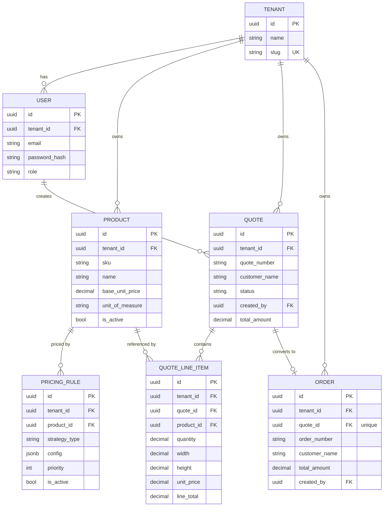

# ForgeFlow

[](https://github.com/UygarGokcen/forgeflow/actions/workflows/ci.yml)

**Multi-tenant manufacturing CPQ (Configure-Price-Quote) & order management platform.**

A SaaS backend for B2B manufacturers who sell custom, variant-driven products (cut-to-size
panels, made-to-order parts, etc.) and need to turn a customer conversation into a priced,
auditable quote — without a spreadsheet.

---

## Business Problem

Small and mid-size manufacturers (metal fabrication, custom furniture, signage, glass/panel
cutting, ...) routinely sell products where the final price depends on more than a SKU: it
depends on quantity breaks, surface area, material, and negotiated terms. In practice this
pricing logic lives in someone's head or in a fragile spreadsheet, quotes are retyped into
orders by hand, and there's no single source of truth a sales rep, ops manager, or finance
person can all trust.

Off-the-shelf CPQ tools exist, but they're built for single-tenant enterprises or licensed
per-seat SaaS with pricing that doesn't fit a shop running a handful of product lines. A
manufacturer running multiple brands/plants, or a software vendor serving *many* such
manufacturers, needs the tenant isolation of a real SaaS platform with pricing logic that's
actually extensible in code.

## Why ForgeFlow

- **Multi-tenant from day one** — not bolted on later. Tenant isolation is enforced at the
  database level (Postgres Row-Level Security), not just in application code, so a bug in a
  service class can't leak one tenant's quotes into another's.
- **Pricing as a strategy, not a spreadsheet formula.** Volume discounts and area-based pricing
  (the "Sineset problem" — price a custom-cut panel by width × height, not by piece) are
  pluggable [`PricingStrategy`](src/main/kotlin/com/forgeflow/service/pricing) implementations,
  configured per product via JSON, not hardcoded `if` statements.
  A pricing rule's config is validated **at rule-creation time** against the real strategy, so a
  malformed rule fails fast with a clear 400 instead of silently corrupting a quote later.
- **A real quote lifecycle.** `DRAFT → APPROVED → CONVERTED_TO_ORDER` (or `REJECTED`) as an
  explicit state machine, not a free-text status column — invalid transitions are rejected,
  and an empty quote can't be approved. Converting a quote creates an actual `Order` record
  (its own table, its own number sequence) rather than just flipping a status flag — an order
  is a confirmed, auditable fact distinct from the quote that produced it.
- **Boring, production-grade infrastructure choices.** Flyway over `init.sql`, JWT + Postgres
  RLS over a single shared-schema `WHERE tenant_id = ?` you can forget to add, Docker Compose
  you can `up` in one command.

## Architecture

**Stack:** Kotlin + Spring Boot 3 (Java 21) · Spring Security + JWT · PostgreSQL 16 + Row-Level
Security · Redis · Kafka · Flyway · Docker Compose · springdoc-openapi (Swagger UI) · JUnit 5 +
Testcontainers

**Modular monolith**, package-by-layer with a hexagonal-ish flavor:

```
com.forgeflow/
├── config/     Security (JWT filter, SecurityConfig), the RLS-binding transaction manager, OpenAPI
├── context/    TenantContext, CurrentUser — request-scoped, backed by Spring's RequestAttributes
├── domain/     JPA entities: Tenant, User, Product, PricingRule, Quote, QuoteLineItem, Order
├── dto/        Request/response DTOs (kept separate from entities)
├── repository/ Spring Data JPA repositories
├── service/
│   └── pricing/  Strategy pattern: PricingStrategy + Fixed/VolumeDiscount/AreaBased impls
├── controller/ REST endpoints
└── exception/  Sealed ApiException hierarchy + a single @RestControllerAdvice
```

### Multi-tenancy: JWT claim + Postgres RLS, wired together per-transaction

1. A tenant's JWT carries a `tenant_id` claim, set once at login/registration and never
   trusted from client input alone. An optional `X-Tenant-ID` header is cross-checked against
   the claim and rejected (403) on mismatch — it can *narrow* what a request claims to be
   acting as, never widen it.
2. `JwtAuthenticationFilter` resolves the claim and stores it in
   [`TenantContext`](src/main/kotlin/com/forgeflow/context/TenantContext.kt), which uses Spring's
   `RequestAttributes` rather than a raw `ThreadLocal` — attributes are bound to the servlet
   request itself, so nothing can leak across requests on a pooled thread.
3. Every tenant-scoped table has `ALTER TABLE ... ENABLE ROW LEVEL SECURITY` **and**
   `FORCE ROW LEVEL SECURITY` (see [`V1__init_schema.sql`](src/main/resources/db/migration/V1__init_schema.sql))
   with a policy of `tenant_id = current_setting('app.current_tenant')`. The `FORCE` matters:
   Postgres exempts a table's *owner* from its own RLS policies by default, so the app connects
   as a separate, unprivileged `forgeflow_app` role — not the `forgeflow` migration/admin role,
   which is a Postgres superuser and would bypass RLS unconditionally regardless of `FORCE`.
4. [`TenantAwareJpaTransactionManager`](src/main/kotlin/com/forgeflow/config/TenantAwareJpaTransactionManager.kt)
   overrides `doBegin()` to run `SELECT set_config('app.current_tenant', ?, true)` — the
   Postgres equivalent of `SET LOCAL`, scoped to the current transaction only — the moment a
   transaction opens, before any query on that connection can run. Every repository query
   method carries an explicit `@Transactional`; Spring Data's implicit default transactional
   wrapping for derived query methods was found *not* to reliably route through a custom
   transaction manager, which would silently skip the tenant bind.

The net effect: even a bug that forgets a `WHERE tenant_id = ?` clause in application code
still can't return another tenant's rows, because the database itself won't allow it.

### Pricing Strategy Pattern

```
PricingStrategy (interface)
├── FixedPricingStrategy        unitPrice × quantity
├── VolumeDiscountStrategy      unitPrice × (1 − discountPercent) × quantity, once quantity ≥ minQuantity
└── AreaBasedPricingStrategy    unitPrice × width × height × multiplier × quantity
```

`PricingRule.config` is a JSONB blob (Hibernate 6's native JSON mapping, no extra library) whose
shape depends on `strategyType`. `PricingStrategyResolver` collects all `PricingStrategy` beans
and dispatches by type — adding a new strategy (e.g. tiered volume pricing) means adding one
`@Component`, no `when` block to update.

### Redis: pricing lookup cache

`QuoteService.addLineItem` looks up the target product and its active pricing rules on *every*
line item — rarely-changing data being re-read from Postgres on the hottest path in the app.
[`PricingLookupCache`](src/main/kotlin/com/forgeflow/service/PricingLookupCache.kt) wraps just
those two lookups with `@Cacheable`/`@CacheEvict`, deliberately not a general-purpose cache: a
5-minute TTL is the safety net, but `ProductService.update/delete` and `PricingRuleService.create/
delete` evict explicitly (write-through) so a price change never sits stale for the TTL window.
Every cache key includes `tenantId` explicitly — never inferred from context — so a caching bug
can't become a cross-tenant data leak the way a missing `WHERE tenant_id = ?` could.

One non-obvious fix baked into `CacheConfig`: Spring Data Redis's `GenericJackson2JsonRedisSerializer`
needs an `ObjectMapper` with `JavaTimeModule` registered (or every entity's `Instant` fields fail
to serialize) *and* default typing activated (or a cached `List<PricingRule>` deserializes back as
`List<LinkedHashMap>` due to generic type erasure, throwing `ClassCastException` at the pricing
call site) — both configured explicitly rather than relying on the no-arg constructor.

### Kafka: quote → order event stream

Converting a quote publishes an `OrderConvertedEvent` to the `forgeflow.order-events` topic —
the seam a notification service, a fulfillment/ERP integration, or a billing system would
subscribe to, none of which this platform has yet
([`OrderEventListener`](src/main/kotlin/com/forgeflow/event/OrderEventListener.kt) is a stand-in
that just logs, to prove the event is actually consumable).

The publish is wired through
[`OrderEventPublisher`](src/main/kotlin/com/forgeflow/event/OrderEventPublisher.kt) as a
`@TransactionalEventListener(phase = AFTER_COMMIT)` reacting to a plain Spring `ApplicationEvent`
that `QuoteService.updateStatus` raises *inside* its `@Transactional` method — not a direct
`KafkaTemplate.send()` call from there. This ordering matters: if the event were published inside
the transaction and something later forced a rollback, the topic would carry a "phantom" event for
an Order that never actually exists in Postgres. `AFTER_COMMIT` guarantees the Kafka message is
only ever sent once the Order is durably persisted, and a Kafka outage is logged rather than
failing (or rolling back) a conversion that Postgres has already committed.

Docker Compose runs a single-node Kafka broker in KRaft mode (no Zookeeper). One setting is
required and easy to miss: `offsets.topic.replication.factor` defaults to `3`, and with only one
broker available the internal `__consumer_offsets` topic can never satisfy that, so it's pinned to
`1`. Left at the default, every consumer *group* join silently hangs forever (`FindCoordinator`
never resolves) — direct partition/offset reads still work fine, which is what made this
confusing to track down.

## ER Diagram



## Getting Started

Requires only Docker.

```bash
docker-compose up --build
```

This starts Postgres, Redis and a single-node Kafka broker, runs Flyway migrations automatically
on app boot, and serves the API on `http://localhost:8080`. Interactive API docs (with a built-in
JWT "Authorize" button): `http://localhost:8080/swagger-ui.html`.

## API Usage Example

```bash
# 1. Register a tenant (creates the tenant + its first ADMIN user, returns a JWT)
curl -X POST http://localhost:8080/api/v1/auth/register-tenant \
  -H "Content-Type: application/json" \
  -d '{"tenantName":"Acme Manufacturing","tenantSlug":"acme","adminFullName":"Ada Admin","adminEmail":"ada@acme.test","adminPassword":"supersecret1"}'

TOKEN="<token from the response above>"

# 2. Create a product priced per square meter
curl -X POST http://localhost:8080/api/v1/products \
  -H "Content-Type: application/json" -H "Authorization: Bearer $TOKEN" \
  -d '{"sku":"PANEL-01","name":"Steel Panel","baseUnitPrice":20.00,"unitOfMeasure":"SQUARE_METER"}'

PRODUCT_ID="<id from the response above>"

# 3. Attach an area-based pricing rule
curl -X POST http://localhost:8080/api/v1/products/$PRODUCT_ID/pricing-rules \
  -H "Content-Type: application/json" -H "Authorization: Bearer $TOKEN" \
  -d '{"strategyType":"AREA_BASED","config":{"multiplier":1.0}}'

# 4. Create a quote and add a line item — price is computed server-side via the strategy above
QUOTE_ID=$(curl -s -X POST http://localhost:8080/api/v1/quotes \
  -H "Content-Type: application/json" -H "Authorization: Bearer $TOKEN" \
  -d '{"customerName":"Contoso Mfg"}' | jq -r .id)

curl -X POST http://localhost:8080/api/v1/quotes/$QUOTE_ID/line-items \
  -H "Content-Type: application/json" -H "Authorization: Bearer $TOKEN" \
  -d '{"productId":"'"$PRODUCT_ID"'","quantity":1,"width":2.0,"height":1.5}'
# -> lineTotal: 60.00  (20.00 * 2.0 * 1.5 * 1.0)

# 5. Approve the quote, then convert it to an order — this creates a real Order record
curl -X PUT http://localhost:8080/api/v1/quotes/$QUOTE_ID/status \
  -H "Content-Type: application/json" -H "Authorization: Bearer $TOKEN" -d '{"status":"APPROVED"}'
curl -X PUT http://localhost:8080/api/v1/quotes/$QUOTE_ID/status \
  -H "Content-Type: application/json" -H "Authorization: Bearer $TOKEN" -d '{"status":"CONVERTED_TO_ORDER"}'

# 6. The order now exists as its own resource, independent of the quote
curl http://localhost:8080/api/v1/orders -H "Authorization: Bearer $TOKEN"
```

Full endpoint reference: Swagger UI, or [`v3/api-docs`](http://localhost:8080/v3/api-docs) for
the raw OpenAPI spec.

## Testing

```bash
./gradlew test              # unit tests — no Docker required
./gradlew integrationTest   # Testcontainers integration tests — requires a working Docker daemon
```

Unit tests cover the pricing strategies (threshold behavior, area calculation, malformed-config
rejection) with plain JUnit 5 — no mocking needed since they're pure functions of their input —
plus a Mockito-based service-layer suite (`AuthService`, `ProductService`, `PricingRuleService`,
`QuoteService`, `OrderService`) that mocks repositories but wires up the *real* pricing strategies,
so line-item pricing is verified end-to-end rather than just "some method got called."

`integrationTest` boots the real Spring context against Testcontainers-managed Postgres, Redis and
Kafka instances — all three run for real rather than being stubbed, so these tests actually cover
the caching and event-publishing paths, not just the HTTP and persistence layers. The application
datasource connects as the same unprivileged `forgeflow_app` role production uses, which is what
gives `TenantIsolationIntegrationTest` its teeth: it would genuinely fail if row-level security
stopped being enforced, unlike a unit test against mocked repositories.
`QuoteToOrderFlowIntegrationTest` drives the full product → pricing rule → quote → approve →
convert flow through the real REST API.

These are tagged `integration` and excluded from the default `test` task, so `./gradlew build`
stays fast and doesn't depend on Docker being available. CI runs both on every push.

> **Running integration tests on Windows:** run them from inside a WSL2 distro with Docker
> Desktop's WSL integration enabled. Docker Desktop's Windows named-pipe transport has known
> compatibility issues with Testcontainers outside of WSL2 — the client fails to negotiate an API
> version and reports "Could not find a valid Docker environment" even while the Docker CLI itself
> works fine.

## Roadmap

Deliberately out of scope for now, to keep the core domain reviewable:

- **Phase 2 (remaining)**: order fulfillment states (shipped/delivered) beyond the current
  "confirmed on conversion" model; a real downstream consumer of `forgeflow.order-events`
  (notifications, ERP/billing integration) — `OrderEventListener` today is just a logging stub.
- **Phase 3**: Microservice extraction of the pricing engine, inventory domain.
